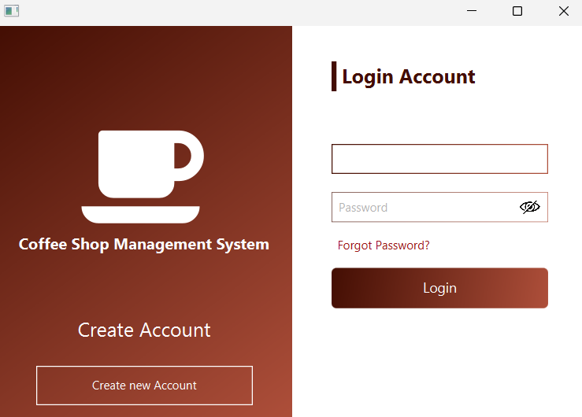
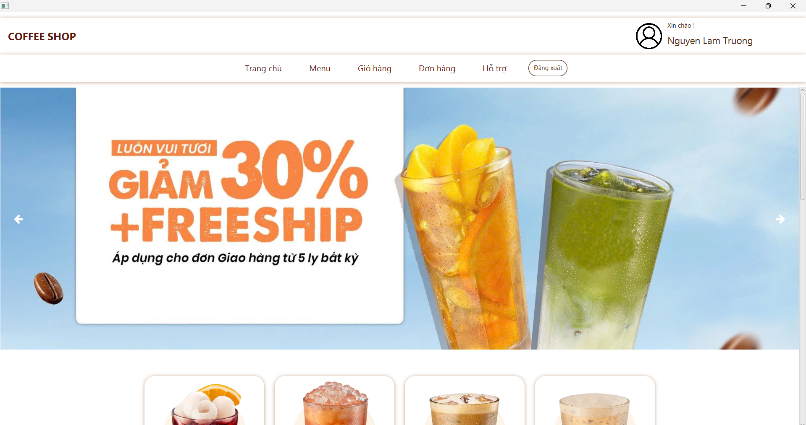
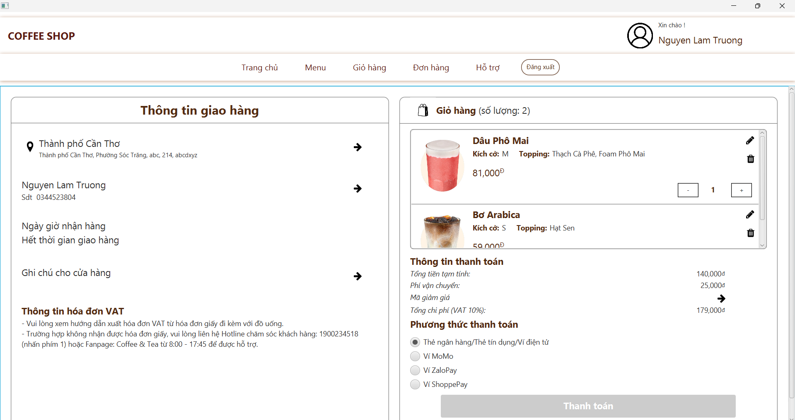
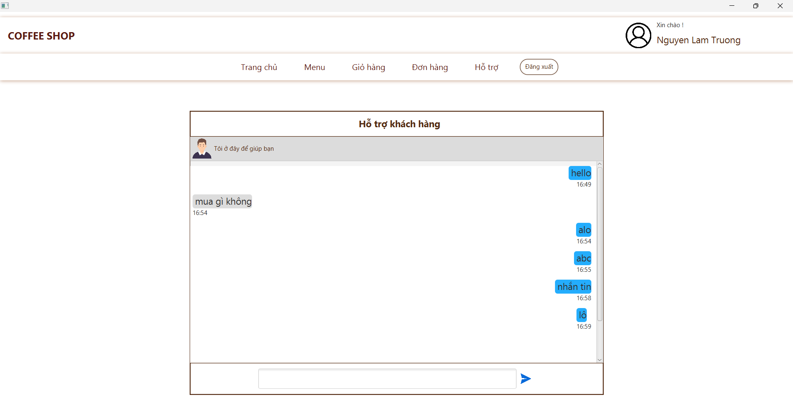
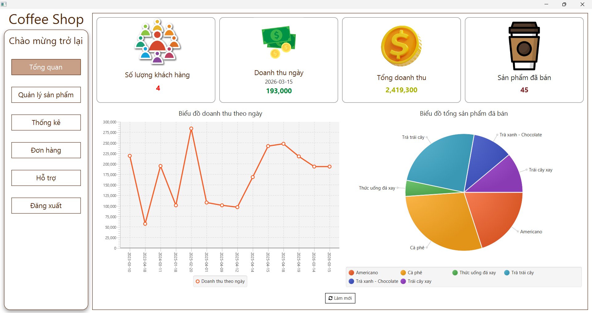
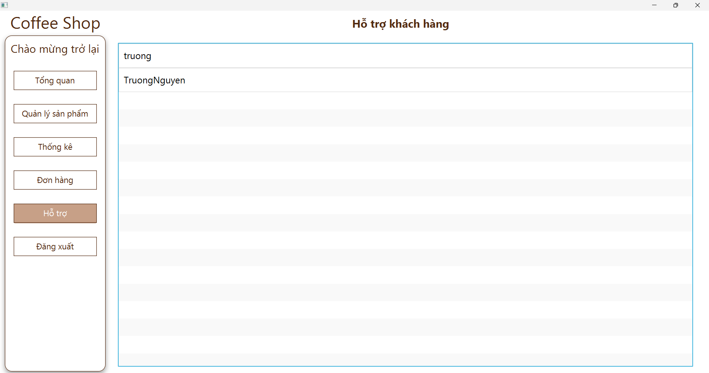
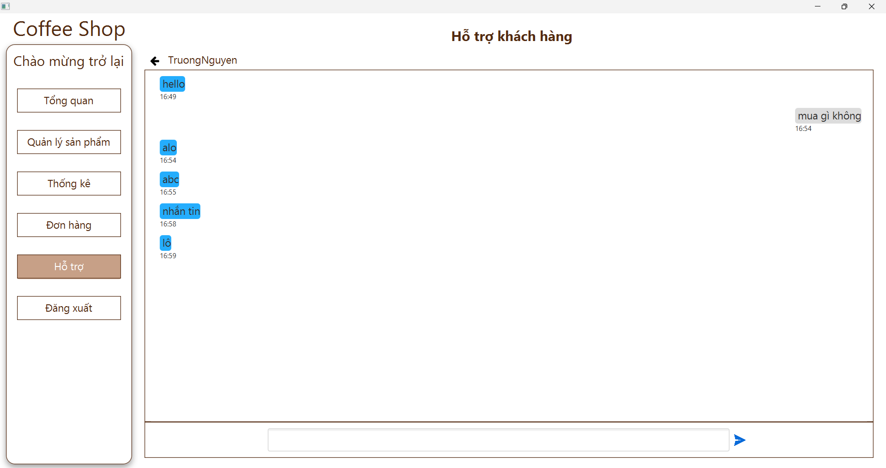

# Coffee Shop Management System

Desktop coffee shop management application built with **Java**, **JavaFX**, **FXML**, **MySQL**, **RabbitMQ**, and **JavaMail**.

This project was created to support common coffee shop operations such as authentication, menu browsing, shopping cart, order placement, order history, admin management, and customer support chat.

## Problem statement

Small coffee shop systems are often split across multiple manual workflows:
- customers place orders manually,
- admins monitor products and orders in separate screens,
- support communication is fragmented,
- order confirmation is not automated.

This project centralizes those workflows into one desktop application for both **customers** and **admins**.

## Main features

### Customer features
- Register account
- Login and logout
- OTP email verification / password recovery flow
- Browse menu and product details
- Add products to cart
- Select size and toppings
- Place orders
- View order history
- Manage account information
- Chat with admin support
- Receive order confirmation email

### Admin features
- Login as admin
- View dashboard summary
- Manage products
- Update product status
- Review order information
- Monitor revenue statistics
- Chat with users

## Screenshots Demo

### Login


### Home 


### Cart 


### Chat Client


### Admin Dashboard


### Customer Support Chat



## Tech stack

- Java 23
- JavaFX SDK 25
- FXML
- MySQL
- RabbitMQ
- Erlang/OTP
- JavaMail
- Gson
- SLF4J

## Architecture overview

After refactoring, the project is organized closer to a layered desktop architecture:

- `application/controller/`  
  JavaFX controllers and UI flow handlers
- `application/model/`  
  domain models, DTOs, and view models
- `application/service/`  
  business logic such as authentication, cart, order, product, dashboard, revenue, email, OTP
- `application/repository/`  
  database access logic
- `application/messaging/`  
  RabbitMQ and chat related classes
- `application/util/`  
  validation, logging, scene navigation, resource loading
- `application/config/`  
  session/config related classes
- `application/`  
  application bootstrap, database/config helpers, shared alerts, and legacy compatibility wrappers
- `sql/`  
  schema and seed files
- `docs/`  
  portfolio, demo, interview, and setup notes
- `screenshots/`  
  place application screenshots for GitHub portfolio

Controllers now focus mainly on:
- receiving UI input,
- calling services,
- updating JavaFX views.

## Project structure

```text
coffeeShopManagementSystem/
├─ docs/
├─ lib/
├─ screenshots/
├─ sql/
├─ src/
│  ├─ application/
│  │  ├─ config/
│  │  ├─ controller/
│  │  ├─ messaging/
│  │  ├─ model/
│  │  ├─ repository/
│  │  ├─ service/
│  │  ├─ util/
│  │  ├─ *.fxml
│  │  ├─ Main.java / shared bootstrap classes
│  │  └─ *.css
│  ├─ Banner/
│  ├─ Image/
│  └─ Product/
├─ app.properties.example
├─ README.md
└─ .gitignore
```

## Requirements

Click the items below to open the official download pages:

- Windows 10/11
- [JDK 23 (Eclipse Temurin)](https://adoptium.net/temurin/releases/?arch=any&os=any&package=jdk&version=23)
- [JavaFX SDK 25](https://jdk.java.net/javafx25/)
- [MySQL 8.x](https://dev.mysql.com/downloads/mysql/)
- [RabbitMQ](https://www.rabbitmq.com/docs/download)
- [Erlang/OTP](https://www.erlang.org/downloads)
- [IntelliJ IDEA](https://www.jetbrains.com/idea/download/) or [Eclipse](https://www.eclipse.org/downloads/)

## Tested environment

This project was tested in the following environment:

- Windows 10/11
- JDK 23
- JavaFX SDK 25
- IntelliJ IDEA / Eclipse
- MySQL 8.x
- RabbitMQ 4.x
- Erlang/OTP compatible with RabbitMQ

## Configuration

Create a local `app.properties` file in the project root based on `app.properties.example`.

Example:

```properties
db.url=jdbc:mysql://localhost:3306/coffee?useSSL=false&serverTimezone=Asia/Ho_Chi_Minh
db.username=root
db.password=

mail.host=smtp.gmail.com
mail.port=587
mail.username=your_email@gmail.com
mail.password=your_gmail_app_password

rabbitmq.host=localhost
rabbitmq.port=5672
rabbitmq.username=guest
rabbitmq.password=guest
```

> Do not commit `app.properties` to GitHub.

## Database setup

### Option 1: portfolio/public demo data
Recommended for GitHub and interview demo use.

1. Create database `coffee`
2. Import `sql/schema.sql`
3. Import `sql/seed.sql`

Demo accounts:
- Admin: `admin` / `Admin@123`
- User: `demo_user` / `User@123`

### Option 2: quick local demo data
1. Create database `coffee`
2. Import `sql/schema.sql`
3. Import `sql/seed-lite.sql`

### Option 3: full original local data
1. Create database `coffee`
2. Import `sql/schema.sql`
3. Import `sql/legacy/seed-full-from-original.sql`

## Manual IDE setup

This project currently does not use Maven or Gradle, so some dependencies must be configured manually in the IDE.

### 1. Add local libraries from the `lib/` folder

Add all `.jar` files inside the `lib/` directory to your project libraries or classpath.

Examples include:
- `amqp-client`
- `gson`
- `mysql-connector-j`
- `javax.mail`
- `slf4j`
- `fontawesomefx`
- `jxmaps`

### 2. Add JavaFX SDK 25 manually

Download JavaFX SDK 25 and configure it in your IDE.

Make sure the JavaFX `lib` folder is used in:
- project libraries
- module path / VM options

Example VM options:

```bash
--module-path "C:\path\to\javafx-sdk-25\lib" --add-modules javafx.controls,javafx.fxml,javafx.graphics,javafx.base
```

### 3. Open and run the main class

Run:

```text
src/application/Main.java
```

## How to run

1. Install JDK 23
2. Install JavaFX SDK 25
3. Install MySQL and create the `coffee` database
4. Import SQL files
5. Install Erlang/OTP
6. Install and start RabbitMQ
7. Create local `app.properties`
8. Open the project in your IDE
9. Add all `.jar` files inside the `lib/` folder to the project
10. Configure JavaFX SDK 25 in the IDE
11. Set the JavaFX VM options
12. Run `src/application/Main.java`

Example JavaFX VM options:

```bash
--module-path "C:\path\to\javafx-sdk-25\lib" --add-modules javafx.controls,javafx.fxml,javafx.graphics,javafx.base
```

## Important notes

- JavaFX is not bundled with JDK 23, so JavaFX SDK must be added manually.
- This project currently depends on manual IDE setup because it does not use Maven or Gradle yet.
- RabbitMQ and Erlang/OTP are required for the chat feature.
- Email sending requires a valid SMTP configuration.
- If you use Gmail SMTP, you must use a Gmail App Password instead of your normal Gmail password.
- `seed.sql` is the recommended public-friendly demo seed.
- `seed-lite.sql` is a lightweight alternative for quick local setup.
- `sql/legacy/seed-full-from-original.sql` is much larger and may not be suitable for a public repository.

## Portfolio docs

- Setup troubleshooting: `docs/SETUP_TROUBLESHOOTING_VI.md`

## Limitations

- This project is designed for local and portfolio use and still depends on desktop environment setup.
- RabbitMQ, SMTP, and JavaFX setup may take time on a new machine.
- Some UI and resource files still follow the original project organization rather than a full Maven or Gradle layout.
